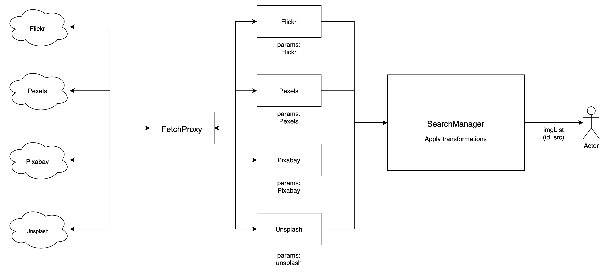

# Bare Images API

Search and Download images from Flickr, Pexels, Pixabay, Unsplash

Here, that classes Flickr, Pexels, Pixabay, Unsplash takes individual params from the `SearchManager` and use `FetchProxy` to request the resources from the individual sources.

## Setup

`yarn install`

## Run

`yarn run`
